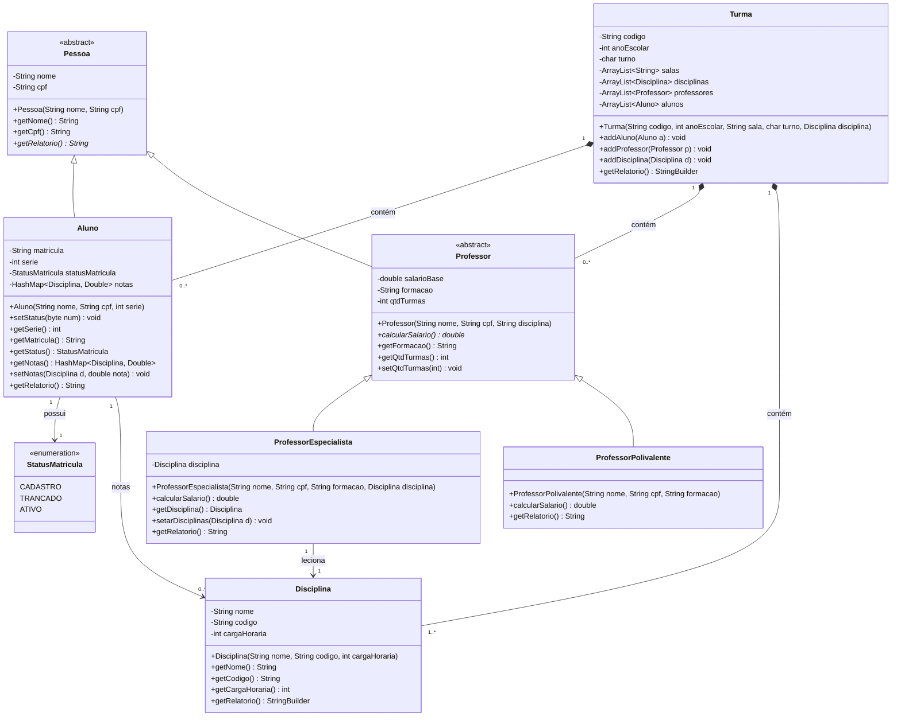
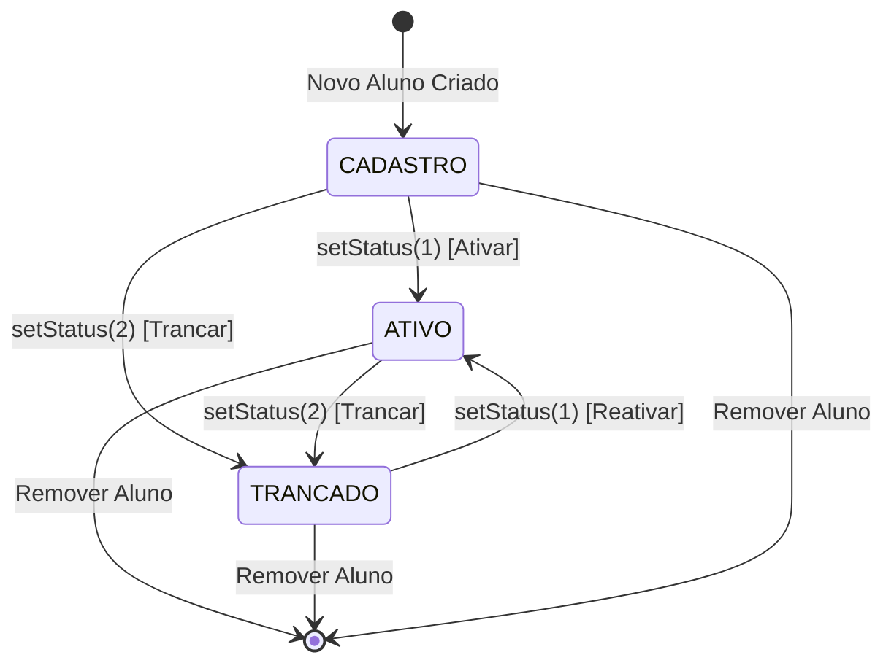

## 4. Diagrama de Classes

---

## 5. Diagrama de Máquina de Estados (Status da Matrícula do Aluno)

Este diagrama representa as transições do ciclo de vida da matrícula de um Aluno dentro da escola:

